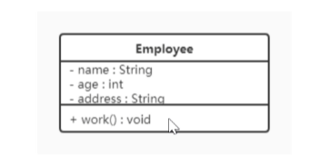

### 概述
展示了模型的静态结构图。
### 作用

UML是以图形化的形式，静态展示类相互之间的关系。

### 表示法
#### 类的表示方法

+ +：public
+ -: &ensp;private
+ #: &ensp;protected
+ 属性表示方式 可见性 名称：类型 [ = 缺省值]。 如：- name: String [ = "test"]
+ 方法表示方式 可见性 名称（参数列表）[： = 返回类型]。 如：+ work(): void
例：

#### 类与类之间的关系
+ 关联关系
1.一般关联关系
1.1 单向关联
以单项箭头表示

1.2 双向关联
以实线连接

1.3 自关联
类自己包含自己

+ 聚合关系
强关联关系，是整体与部分之间的关系
