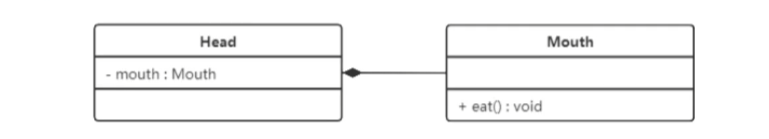
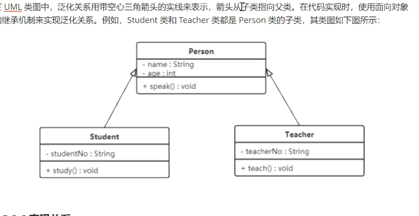

### 概述
展示了模型的静态结构图。
### 作用

UML是以图形化的形式，静态展示类相互之间的关系。

### 表示法
#### 类的表示方法

+ +：public
+ -: &ensp;private
+ #: &ensp;protected
+ 属性表示方式 可见性 名称：类型 [ = 缺省值]。 如：- name: String [ = "test"]
+ 方法表示方式 可见性 名称（参数列表）[： = 返回类型]。 如：+ work(): void
例：

#### 类与类之间的关系
+ 关联关系
1.一般关联关系
1.1 单向关联
以单向箭头表示

1.2 双向关联
以实线连接

1.3 自关联
类自己包含自己

+ 聚合关系
强关联关系，是整体与部分之间的关系。成员对象可以脱离整体对象。例：学校与老师（虚线+空心菱形）

+ 组合关系
整体与局部关系。可以控制部分对象的生命周期，一旦整体不存在，部分也不存在。例：头与嘴（实线+菱形）

+ 依赖关系
临时性的关联，耦合性低。一个类访问另一个类（被依赖）的某些方法来完成一些职责。箭头指向被依赖。（虚线+箭头）

+ 继承关系
耦合度很高，父类与子类的关系。子指向父。（实线+空心箭头）

+ 实现关系
接口与实现类之间的关系，类指向接口。 （虚线 + 空心箭头）
