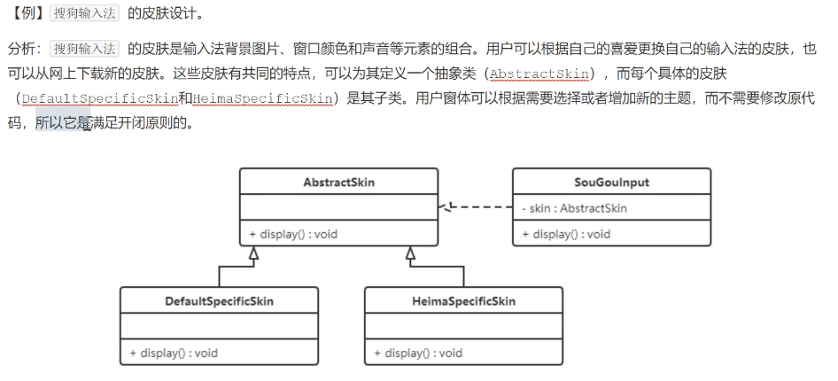
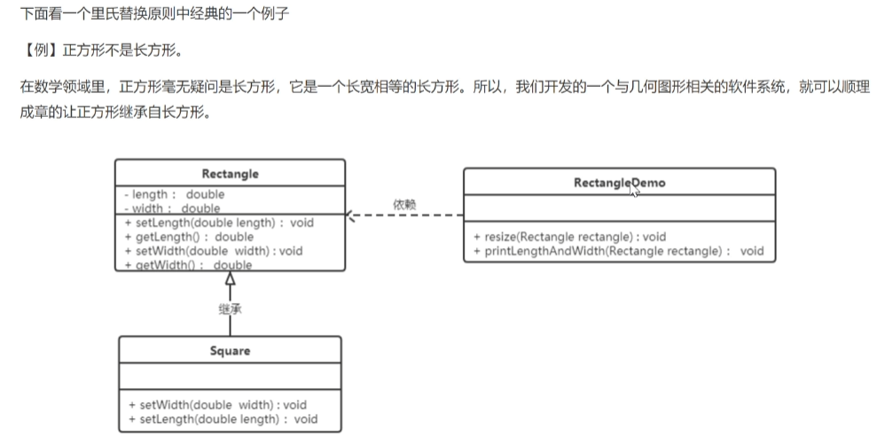
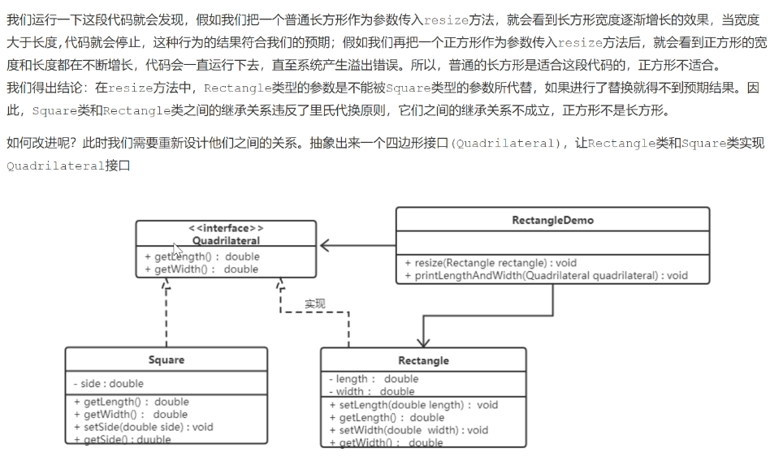

### 特点
可维护性、可复用性、可扩展性、灵活性。
### 原则
+ 开闭原则
对扩展开放，对修改关闭。可扩展类,不能修改原有类.

代码：（设计模式\05实践\principles\open-close.js）
+ 里氏代换原则
子类可以扩展和使用父类的功能，但是不能修改父类的原有功能。

代码：（设计模式\05实践\principles\substitution.js）

代码：（设计模式\05实践\principles\substitution1.js）
+ 依赖倒转原则
+ 接口隔离原则
+ 迪米特法则
+ 合成复用原则