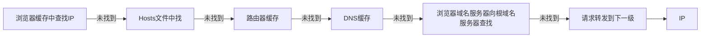
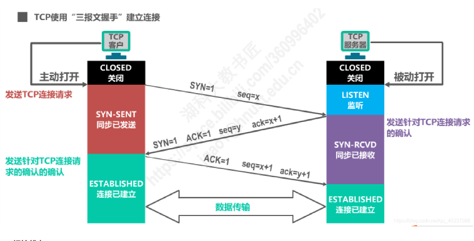
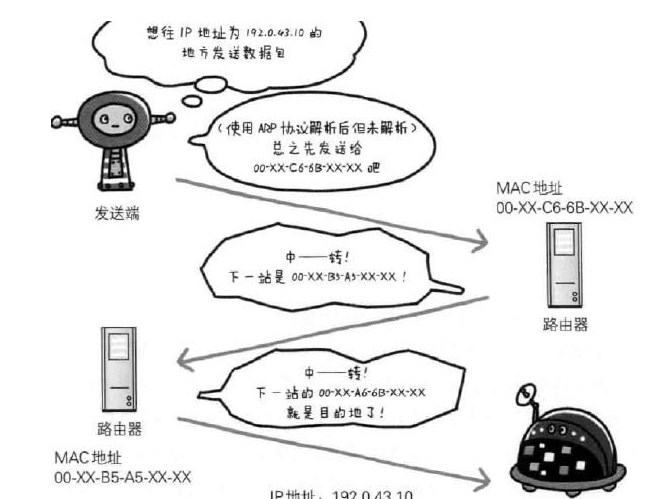
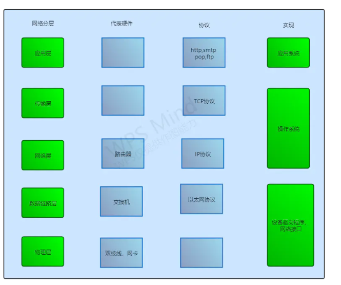
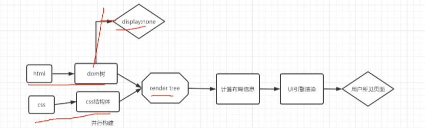
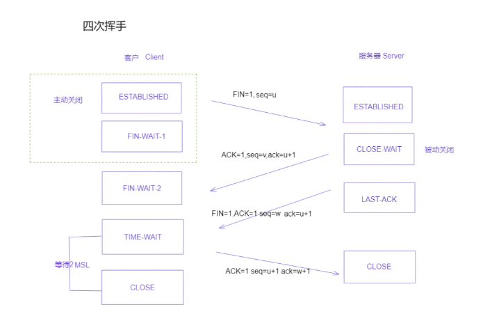

#### 输入URL到页面呈现
* DNS域名解析

* 建立tcp连接
客户端发起请求过程(TCP/IP 5层协议):
    1. 使用应用层发起HTTP请求（url访问时，用的什么协议就发起对应协议去进行请求） 
    2. 传输层的TCP协议为传输报文提供可靠的字节流服务，这里也就使用了TCP三次握手\


    3. 网络层把TCP分割好的各种数据包传送给接收方。而要保证确实能传到接收方还需要接收方的MAC地址，也就是物理地址\

    4. 链路层将数据发送到数据链路层传输。至此请求报文已发出，客户端发送请求的阶段结束

        服务端接受请求处理阶段：

        原路进行处理：链路层—>网络层—>传输层—>应用层然后响应客户端发送报文。
    * TCP/IP协议

    * 渲染页面


    * 断开TCP连接（四次挥手）

TCP头部定义的8位字段，标识了该段TCP报文的作用:
```
            CWR --- 拥塞窗口减小（发送方降低他的发送速率）
            ECE --- ECN回显（发送方接收到了更早的拥塞报告）
            URG --- 紧急（紧急指针，很少用）
            ACK --- 确认（确认号----连接建议以后一般都是启用状态）
            PSH --- 推送（接收方应尽快给应用程序传送这个数据---没被可靠的实现或用到）
            RST --- 重置（连接因错误取消）
            SYN --- 初始化一个连接的同步序列号，请求连接标志
            FIN --- 发送方结束向对方发送数据
```
seq：当前报文序号，它指发送端--> 接收端的数据流的一个字节，且为包含该序号的报文段的数据的第一个字节。
ack: 回复序号，指的是回应对端已收到序号seq的报文，需要ack为序号开头的报文段。 

参考：
https://zhuanlan.zhihu.com/p/134646537 作者：该用户已成仙
https://www.jianshu.com/p/9a340cfedb86 作者：逍遥妙算
https://blog.csdn.net/weixin_48824655/article/details/125324042 作者：小菜哈哈哈哈
https://blog.csdn.net/qq_40337086/article/details/112443124 作者：况祥彬